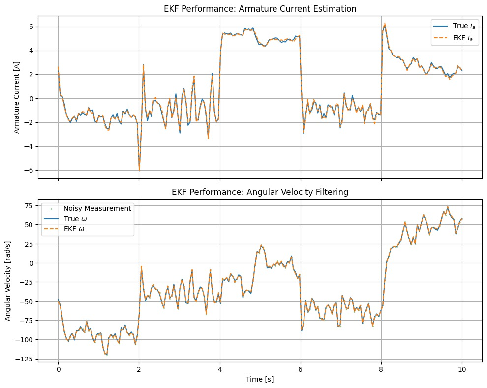
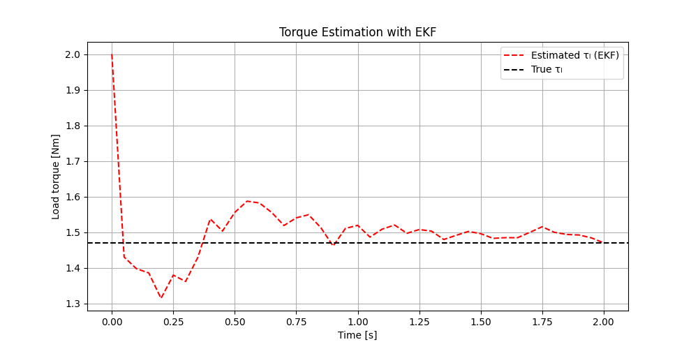
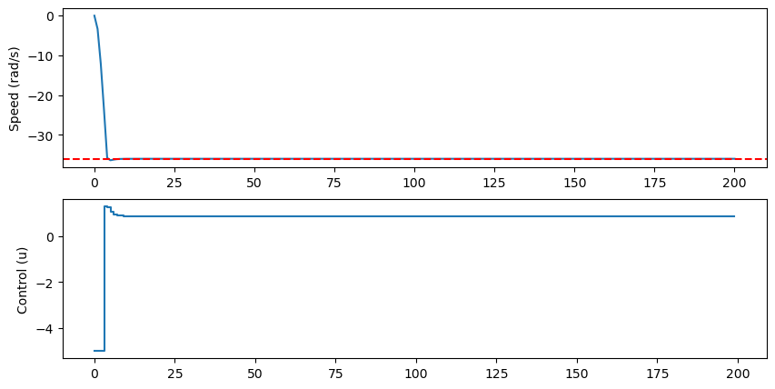
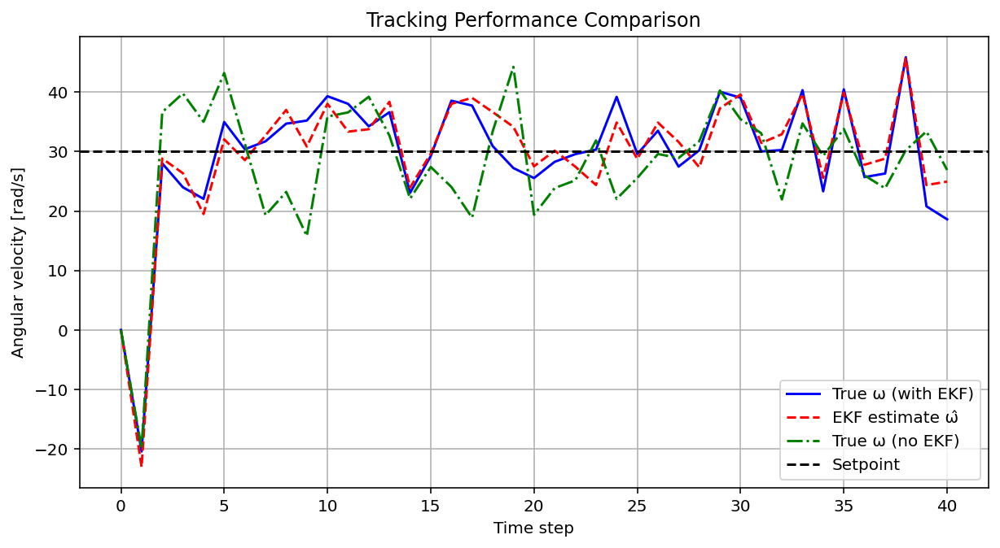
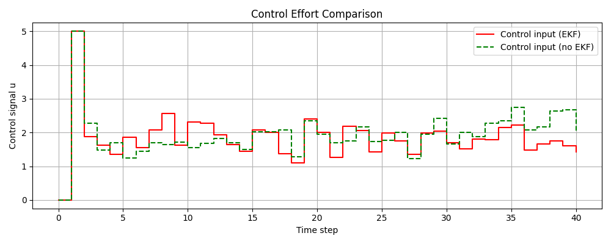

# MPC + EKF Motor Speed Control

> Model Predictive Control with Extended Kalman Filter for DC motor angular velocity regulation — featuring real-time torque estimation and noise-robust state feedback.

---

## What This Does

This project implements a closed-loop control system for a **DC motor** that combines two powerful techniques:

- **MPC (Model Predictive Control)** — optimises control inputs over a rolling horizon, respecting actuator constraints while minimising tracking error.
- **EKF (Extended Kalman Filter)** — estimates unmeasured/noisy states (armature current, angular velocity) and, in the extended version, identifies an unknown **load torque** online.

The result: a controller that drives motor speed to a setpoint in the presence of measurement noise, process disturbances, and unknown loads — using only an angular velocity sensor.

---

## Project Structure

```
├── MPC_EKF_Baseline.py          # 2-state model (ia, ω) — known torque, EKF for noise filtering
└── MPC-EKF_Estimating_Torque.py # 3-state model (ia, ω, τₗ) — EKF estimates unknown load torque
```

### Baseline (`MPC_EKF_Baseline.py`)
- 2-state DC motor model: armature current *iₐ* and angular velocity *ω*
- Load torque `τₗ` is treated as a **known parameter**
- EKF filters noisy ω measurements before passing state to MPC
- MPC horizon: N = 50 steps, dt = 0.01 s

### Torque Estimation (`MPC-EKF_Estimating_Torque.py`)
- Augments the state vector with `τₗ` as a **3rd state** (constant dynamics: dτ/dt = 0)
- EKF simultaneously filters noise **and** estimates the unknown load torque online
- Compares MPC performance with vs. without EKF feedback
- MPC horizon: N = 80 steps, dt = 0.05 s

---

## Motor Model

The DC motor is described by:

```
diₐ/dt  = −(Rₐ/Lₐ)·iₐ − (km/Lₐ)·ω·θ + uₐ/Lₐ
dω/dt   = −(B/J)·ω   + (km/J)·iₐ·θ   − τₗ/J
dτₗ/dt  = 0                                      ← augmented state (torque estimator only)
```

| Parameter | Value | Description |
|-----------|-------|-------------|
| Rₐ | 12.345 Ω | Armature resistance |
| Lₐ | 0.314 H | Armature inductance |
| km | 0.253 Nm/A | Motor constant |
| J | 0.00441 kg·m² | Rotor inertia |
| B | 0.00732 Nm·s/rad | Viscous friction |
| uₐ | 60.0 V | Supply voltage |
| τₗ | 1.47 Nm | True load torque |

Integration uses **4th-order Runge-Kutta** (RK4) via CasADi symbolic differentiation.

---

## Results

### EKF State Estimation
The EKF accurately tracks both armature current and angular velocity across varying operating points, even under significant measurement noise.



### Load Torque Estimation
Starting from an incorrect initial guess (2.0 Nm vs. true 1.47 Nm), the EKF converges to the true torque within ~1 second.



### MPC Tracking (Baseline)
The MPC drives ω to the setpoint rapidly with smooth control effort and tight constraint satisfaction.



### Integrated Control Loop & Offset-Free Performance
With the full 3-state model, the EKF-fed MPC tracks the 30 rad/s setpoint despite unknown load torque. The EKF variant (red) produces noticeably smoother and more conservative control effort compared to the no-EKF case (green), which over-reacts to raw noisy measurements.

| | With EKF | Without EKF |
|---|---|---|
| Setpoint tracking | Smooth, close to reference | Noisy, higher variance |
| Control effort | Lower, more consistent | Larger swings |
| Robustness | Filters disturbances | Amplifies measurement noise |




---

## Setup & Usage

### Requirements

```bash
pip install -r requirements.txt
```

### Run

```bash
# Baseline: 2-state model, known torque
python MPC_EKF_Baseline.py

# Extended: 3-state model, unknown torque estimated online
python MPC-EKF_Estimating_Torque.py
```

Each script runs a full closed-loop simulation and displays matplotlib plots directly.

---

## Key Design Choices

| Choice | Rationale |
|--------|-----------|
| CasADi + IPOPT | Symbolic auto-differentiation for Jacobians; industry-standard NLP solver |
| RK4 discretisation | Better accuracy than Euler for stiff motor dynamics |
| State augmentation (τₗ) | Avoids separate observer design; torque appears naturally in EKF covariance |
| Warm-starting MPC | Reuses previous solution as initial guess → faster convergence |
| Measurement: ω only | Realistic sensor assumption — current sensing omitted deliberately |

---

## Skills Demonstrated

- Nonlinear optimal control (MPC via NLP)
- Bayesian state estimation (EKF)
- Symbolic computation & automatic differentiation (CasADi)
- System identification / parameter estimation (online torque)
- Python scientific stack (NumPy, Matplotlib)

---

## Author

University team project — Control Systems / Mechatronics  
2026
