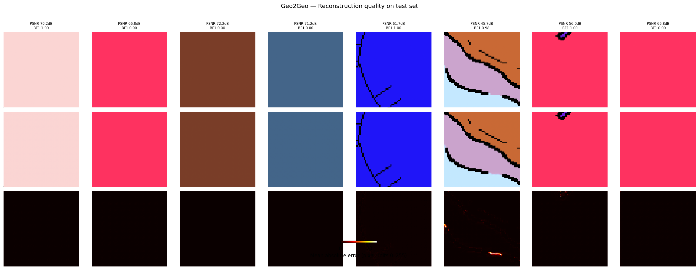
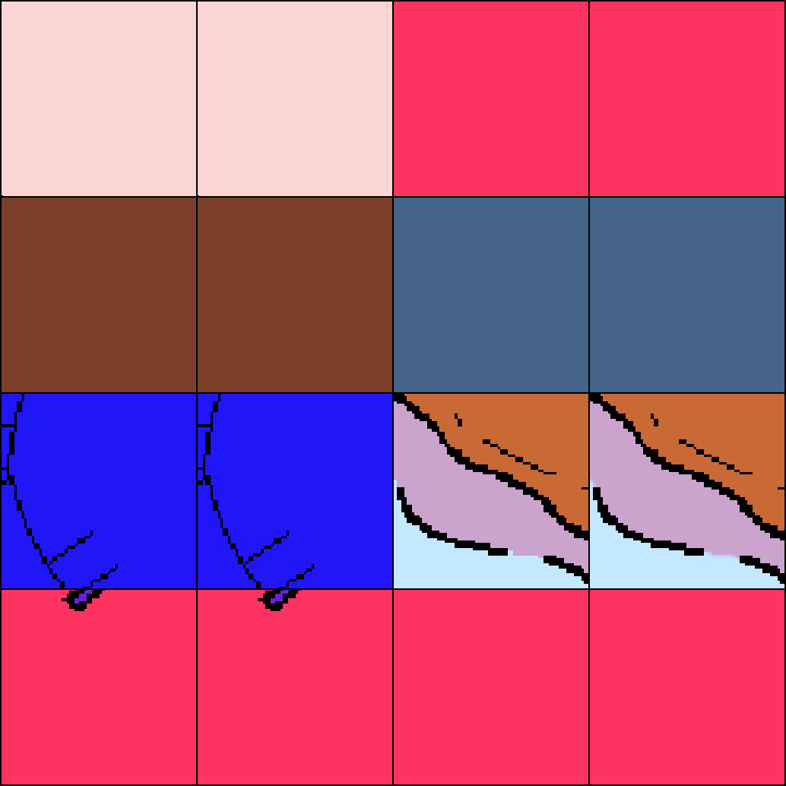
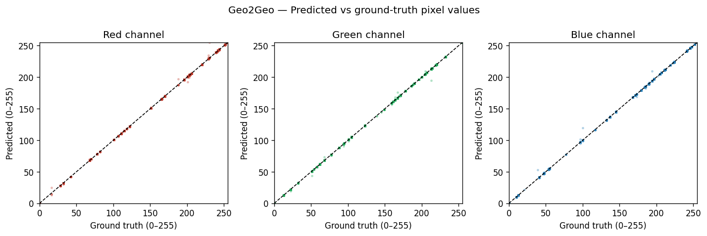
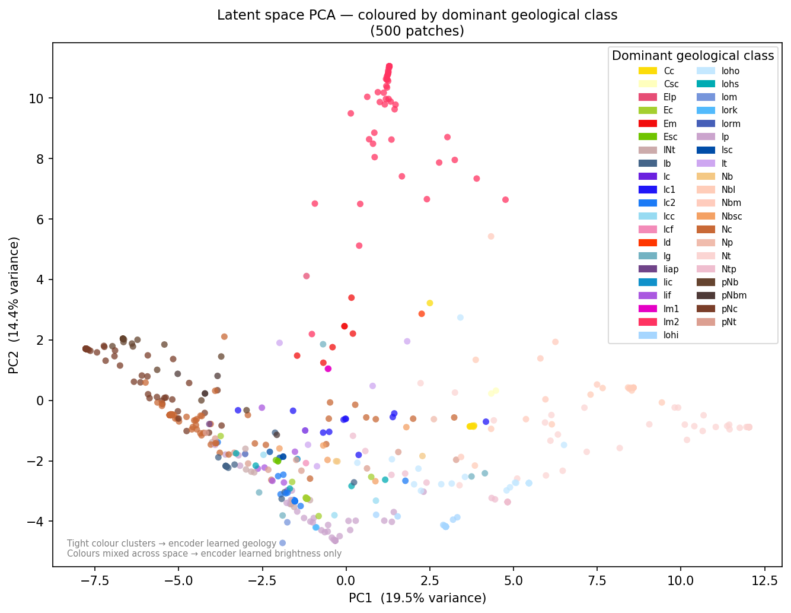

# 🌕 Geo2Geo — Lunar Geomap RGB Reconstruction Autoencoder

> A Vision Transformer (ViT) autoencoder that reconstructs lunar geological map patches at high fidelity. Designed as the **RGB reconstruction backbone** of a larger multimodal lunar analysis pipeline.

---

## 📋 Table of Contents

- [Overview](#overview)
- [Pipeline Architecture](#pipeline-architecture)
- [Model Architecture](#model-architecture)
- [Repository Structure](#repository-structure)
- [Installation](#installation)
- [Usage](#usage)
- [Evaluation & Results](#evaluation--results)
- [Outputs](#outputs)

---

## Overview

Geo2Geo is a Transformer-based image autoencoder trained on lunar geological map (geomap) patches. Given a 256×256 RGB geomap tile as input, the model learns to:

1. **Encode** it into a compact latent representation using a ViT-style patch encoder
2. **Reconstruct** the original image via a convolutional upsampling decoder

The learned latent space captures both **colour fidelity** and **spatial geological structure** (class boundaries), making it a meaningful feature extractor for downstream tasks in the pipeline.

---

## Pipeline Architecture

Geo2Geo is **Stage 1** of a multimodal lunar analysis pipeline:

```
┌─────────────────────────────────────────────────────────────┐
│                  Multimodal Lunar Pipeline                  │
│                                                             │
│  ┌──────────────┐     ┌──────────────┐     ┌────────────┐  │
│  │  Geo2Geo     │     │  [Stage 2]   │     │ [Stage 3]  │  │
│  │  RGB Recon   │────▶│  [Modality]  │────▶│  [Task]    │  │
│  │  Autoencoder │     │  Fusion      │     │  Head      │  │
│  └──────────────┘     └──────────────┘     └────────────┘  │
│         │                                                   │
│   Latent space                                              │
│  (B, 256, 512)                                              │
└─────────────────────────────────────────────────────────────┘
```

The encoder's output — a sequence of patch embeddings `(B, num_patches, hidden_dim)` — is consumed by subsequent stages for multimodal fusion. Geo2Geo is pretrained independently before being integrated into the full pipeline.

---

## Model Architecture

```
Input Image (B, 3, 256, 256)
        │
        ▼
┌───────────────────────────────────┐
│           ENCODER                 │
│  Conv2d patch projection (16×16)  │  (B, 256, 512)
│  + Learnable positional embedding │
│  Transformer Encoder (6 layers)   │
│    • 8 attention heads            │
│    • FFN dim = 2048               │
│    • GELU activation, dropout 0.1 │
└───────────────────┬───────────────┘
                    │  latent (B, 256, 512)
                    ▼
┌───────────────────────────────────┐
│           DECODER                 │
│  Reshape → (B, 512, 16, 16)       │
│  Bottleneck Conv 512→256          │
│  ConvTranspose2d ×4  256→128      │  → (B, 128, 64, 64)
│  ConvTranspose2d ×4  128→64       │  → (B, 64, 256, 256)
│  Conv refinement + Tanh head      │
└───────────────────────────────────┘
        │
        ▼
Reconstructed Image (B, 3, 256, 256)  ∈ [-1, 1]
```

| Component | Details |
|---|---|
| Patch size | 16×16 px |
| Image size | 256×256 px |
| Num patches | 256 |
| Hidden dim | 512 |
| Attention heads | 8 |
| Encoder layers | 6 |
| Total parameters | ~37M |
| Output activation | Tanh (pixels in [-1, 1]) |

---

## Repository Structure

```
geo2geo/
├── model.py              # Encoder, Decoder, Geo2Geo nn.Module definitions
├── trainsahana.py        # Training loop with checkpointing
├── validate.py           # Evaluation: metrics, reconstruction grid, PCA plots
├── lunarGeoData.py       # LunarGeoData dataset class
├── requirements.txt      # Python dependencies
├── .gitignore
├── README.md
└── logs/                 # Evaluation outputs (gitignored)
    ├── val_metrics.json
    ├── val_grid.png
    ├── val_scatter.png
    ├── latent_pca.png
    └── latent_pca_geo.png
```

---

## Installation

```bash
git clone https://github.com/<your-username>/geo2geo.git
cd geo2geo
pip install -r requirements.txt
```

Requires Python 3.9+ and a CUDA-capable GPU for training.

---

## Usage

### Quick smoke test

```bash
python model.py
# Running on: cuda
# Input  : torch.Size([4, 3, 256, 256])
# Output : torch.Size([4, 3, 256, 256])
# Params : 37,xxx,xxx
```

### Training

```bash
python trainsahana.py \
  --root /path/to/data \
  --patch_size 256 \
  --stride 128 \
  --hidden_dim 512 \
  --nheads 8 \
  --num_layers 6 \
  --epochs 100 \
  --batch_size 32
```

### Validation & Evaluation

```bash
python validate.py \
  --root /path/to/data \
  --checkpoint runs/lunar_ae/checkpoints/best.pt \
  --save_grid \
  --save_scatter \
  --save_pca \
  --log_dir logs/
```

### Inference only (encode / decode)

```python
import torch
from model import Geo2Geo

model = Geo2Geo().to("cuda")
model.load_state_dict(torch.load("best.pt")["model"])
model.eval()

image = torch.randn(1, 3, 256, 256).to("cuda")  # normalised to [-1, 1]

with torch.no_grad():
    latent = model.encode(image)   # (1, 256, 512)
    recon  = model.decode(latent)  # (1, 3, 256, 256)
```

---

## Evaluation & Results

Evaluation is run on a held-out test split (15% of 361,675 total patches = **54,252 test patches**).

| Metric | Description |
|---|---|
| **PSNR (dB)** | Pixel-level reconstruction fidelity |
| **Boundary F1** | Harmonic mean of precision & recall on geological class boundaries |
| **Boundary Precision** | Fraction of predicted boundary pixels that are true boundaries |
| **Boundary Recall** | Fraction of true boundary pixels correctly predicted |

Boundary F1 is the primary structural metric — it measures whether the model correctly reconstructs geological region edges, not just average colour.

### Results

| Checkpoint | PSNR ↑ | Boundary F1 ↑ | Boundary Precision ↑ | Boundary Recall ↑ | MAE ↓ |
|---|---|---|---|---|---|
| `best.pt` | 61.71 dB ± 7.16 | 0.7634 ± 0.4187 | 0.7596 ± 0.4174 | 0.7677 ± 0.4207 | 0.1017 ± 0.0706 |


### Reconstruction Grid

*Top row: Original — Middle row: Reconstruction — Bottom row: Absolute error heatmap*



### Side-by-side Comparison



### Per-channel Scatter (Predicted vs Ground Truth)

Points tightly along the diagonal indicate near-perfect pixel-level colour reproduction across all three channels.



### Latent Space PCA — Coloured by Geological Class

Each point represents one 256×256 patch; colour = dominant geological class. Tight same-colour clusters confirm the encoder has learned geology-aware, not just brightness-aware, representations.



**Boundary F1 interpretation:**
- `> 0.70` ✅ Boundaries well reconstructed — encoder learned spatial structure
- `0.40–0.70` Partial — boundaries detected but displaced or blurred
- `< 0.40`  Poor — model ignoring boundary structure (colour shortcut likely)

---

## Outputs

`validate.py` saves the following to `--log_dir`:

| File | Description |
|---|---|
| `val_metrics.json` | Per-sample and aggregate metrics |
| `val_grid.png` | Original \| Reconstruction \| Error heatmap |
| `val_scatter.png` | Predicted vs GT per-channel scatter plots |
| `latent_pca.png` | 2-D PCA of latent space, coloured by PC1 |
| `latent_pca_geo.png` | 2-D PCA coloured by dominant geological class |

The geological PCA distinguishes two scenarios:
- **Tight colour clusters** → encoder learned geology-aware features
- **Mixed colours** → encoder learned brightness/colour only

---

## License

MIT — see [LICENSE](LICENSE).
